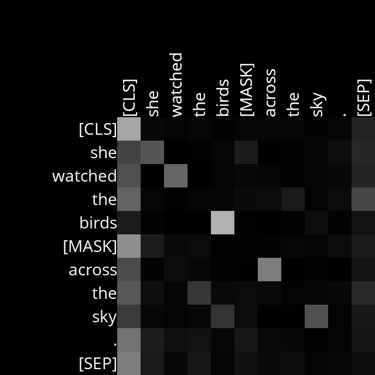
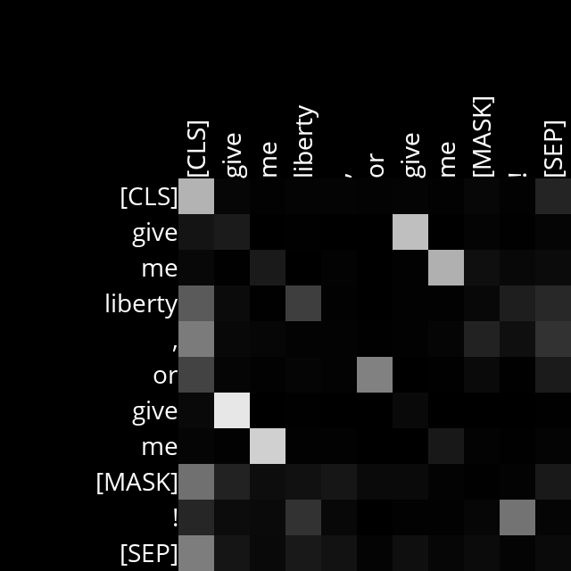
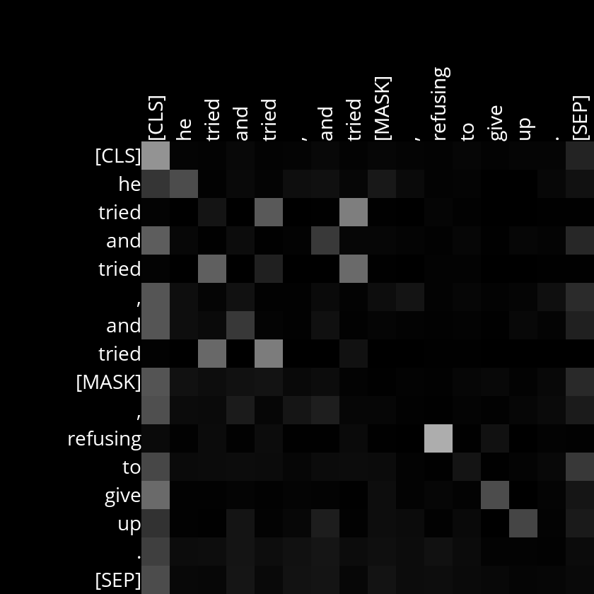
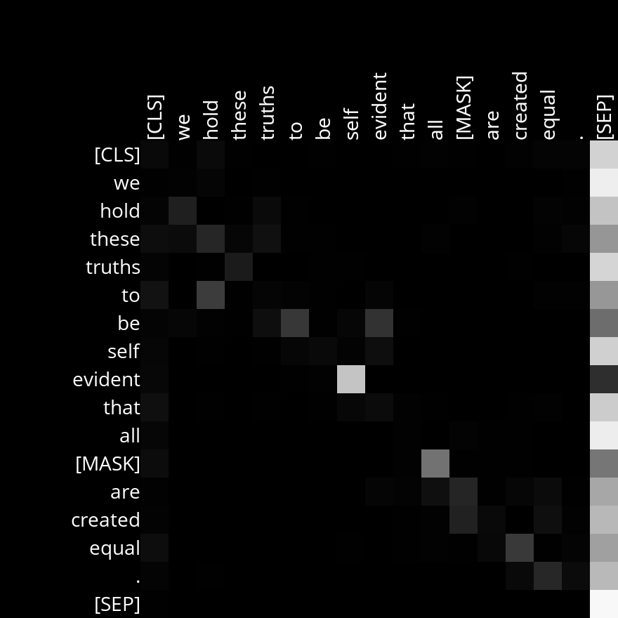
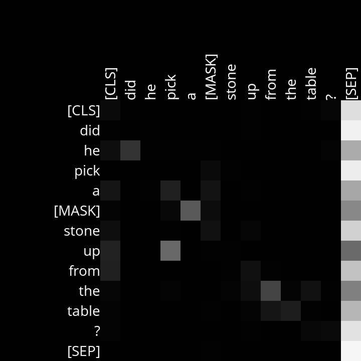
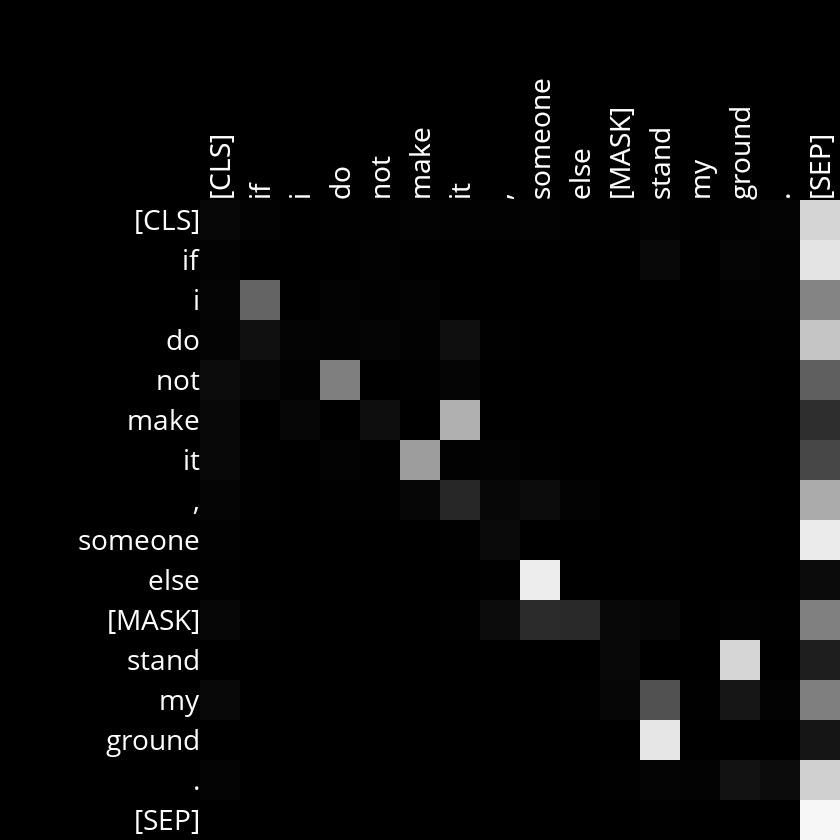

Analysis
Layer 2, Head 12
The tokens seem to pay attention to themselves, unless there are other tokens in the the sentence like themselves, in which case the tokens pay more attention to those other than themselves. The attention is stronger for more "meaningful" words, such as nouns, pronouns, verbs and adjectives, than it is for articules, prepositions, punctuation and the mask token.

Example Sentences:

She watched the birds [MASK] across the sky.

Give me liberty, or give me [MASK]!

He tried and tried, and tried [MASK], refusing to give up.

Layer 5, Head 8
The tokens seem to pay attention to one other token that it can form a unit with, e.g. "pick up", "stand ground", "make it", "someone else". The association is especially strong in word pairs that can be written through a dash, e.g. "self-evident".

Example Sentences:

We hold these truths to be self evident that all [MASK] are created equal.

Did he pick a [MASK] stone up from the table?

If I do not make it, someone else [MASK] stand my ground.

